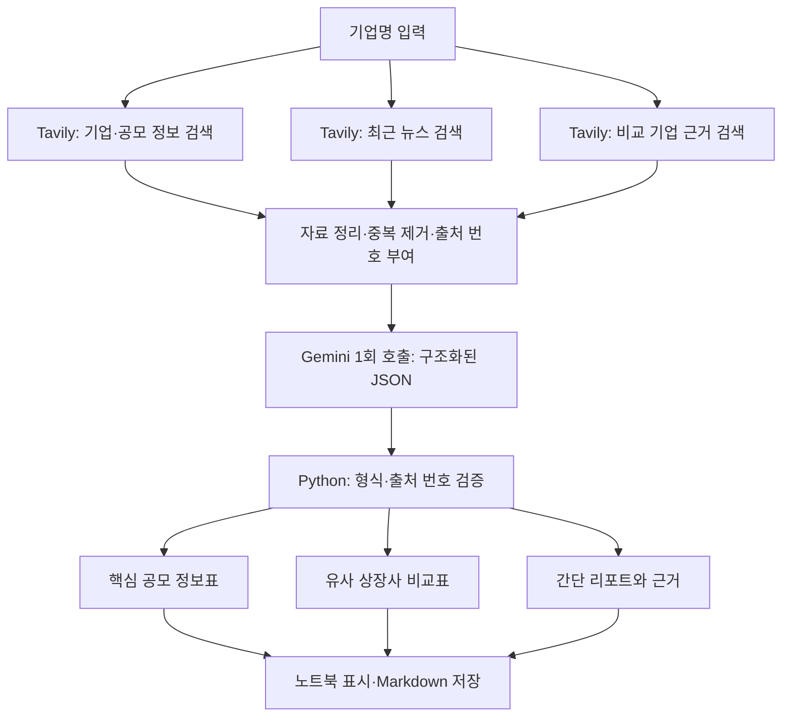

# IPO AI Agent

실제 기업명을 입력하면 Tavily 검색 자료를 바탕으로 Gemini가 짧은 공모주 조사 리포트를 작성한다.
로컬 Miniforge 환경과 `notebooks/ipo_agent.ipynb` 하나에서 개발한다.

## 동작 방식



Gemini 사용량을 줄이기 위해 검색 순서는 Python 코드에 고정했다.
모델은 최종 리포트 작성에만 호출하며 검색어 생성이나 추가 조사 판단에는 호출하지 않는다.
자료가 부족한 항목은 추가 검색 없이 `확인하지 못함`으로 표시한다.
구조도는 자료 흐름을 나타내며 실제 검색은 기업·공모 → 뉴스 → 비교 기업 순서로 실행한다.

## 리포트 내용

### 핵심 공모 정보표

희망 공모가, 확정 공모가, 청약 일정, 상장일·예정일, 기관 수요예측 경쟁률,
일반 청약 경쟁률, 의무보유확약률·집계 기준을 각각 표시한다.
희망 가격과 확정 가격, 기관과 일반 청약 경쟁률을 구분하고 일정에는 연도와 예정 여부를 포함하도록 요청한다.
확인되지 않거나 자료가 상충하는 값은 빈 값으로 받아 `확인하지 못함`으로 표시한다.
미확인 공모 항목은 추가 확인 목록에 모은다.

### 출처 유형과 수집 발췌

각 표에 근거 번호를 붙이고, 번호를 누르면 출처 유형·게시일·조회 시각·실제 수집 발췌·원문 링크로 이동한다.
발췌는 Tavily가 반환한 본문의 일부이며 공백을 정리하고 길이를 제한한다. Gemini가 인용문을 만들지 않는다.
출처 유형은 Python이 도메인을 기준으로 분류한다.

| 유형 | 분류 기준 |
| --- | --- |
| 공시 | DART, KIND 도메인 |
| 회사 공식 | 사용자가 확인하여 `VERIFIED_COMPANY_DOMAINS`에 등록한 도메인 |
| 주관사 공식 | 사용자가 확인하여 `VERIFIED_UNDERWRITER_DOMAINS`에 등록한 도메인 |
| 언론 | 코드의 `NEWS_DOMAINS`에 등록된 언론 도메인 |
| 기타·미분류 | 위 조건에 해당하지 않는 출처 |

회사·주관사 도메인 설정은 기본적으로 비어 있다. 미등록 도메인을 자동으로 공식 출처라고 추정하지 않는다.
분류는 문서의 정확성·최신성을 보증하는 점수가 아니다.

### 유사 상장사 비교표

기존 두 검색에 `"기업명" 증권신고서 비교기업 유사회사` 검색을 한 번 추가한다.
세 검색에서 자료를 번갈아 담아 비교 기업 근거가 입력 한도 때문에 뒤로 밀리는 것을 줄인다.
중복 URL은 제거하며 연합뉴스의 AMP/일반 페이지도 같은 자료로 처리한다.

Gemini는 전달된 자료에서 **상장 시장과 사업상 유사성이 확인되는 기업 최대 3곳**을 고른다.
기업명·상장 시장·선정 근거·유사점·차이점·출처를 표시한다. 목표는 2~3곳이지만 근거가 부족하면 0~1곳만 남긴다.
`공시상 비교기업`은 공시 원출처에 실제 선정된 기업에만 사용하고, 그 외는 `사업 유사성 비교`로 구분한다.
차이가 확인되지 않으면 `확인하지 못함`으로 표시한다. 현재 주가·PER·PBR·시가총액 비교는 포함하지 않는다.

기업 개요, 최근 이슈, 근거에 따른 해석은 각각 한 문장으로 함께 생성한다.
표와 요약은 Gemini의 단일 JSON 응답에서 얻고, Python이 표시와 파일 저장을 담당한다.

확인된 사실에는 자료 번호를 붙이고, 출처 링크는 Python이 Tavily 결과에서 가져온다.
공모 정보는 공시·회사·주관사 원출처를 우선하며, 게시일과 조회 시각을 구분한다.
검색 결과의 짧은 발췌를 사용하므로 원문 전체를 검토한 보고서는 아니다.
출처가 있다고 내용의 정확성이 자동 검증되는 것은 아니며 공모 정보의 원문 검증은 별도로 필요하다.

## 사용량 제한

| 항목 | 기본 설정 |
| --- | --- |
| Gemini | 새 리포트당 요청 최대 1회 |
| 모델 | `gemini-3.5-flash-lite` |
| 사고 수준 | 가장 낮은 `MINIMAL` |
| 출력 한도 | 최대 1,200토큰, 값·문장은 가급적 60자 이내로 요청 |
| Gemini에 전달할 자료 JSON | 최대 3,000자, 자료당 본문 발췌 최대 350자 |
| Tavily | 실행당 검색 최대 3회, 검색당 최대 3개 결과 |
| 검색 옵션 | basic, 자동 옵션 조정·답변 생성·원문 전체 추출 비활성화 |
| 재시도·이어쓰기 | 자동 실행 없음 |
| 검색 결과 없음 | Gemini 호출 생략 |
| 같은 날 재조회 | 저장된 검색 및 리포트 재사용 |

출력 상한은 두 표의 JSON 필드까지 한 번에 담도록 기존 600에서 1,200토큰으로 조정했다.
3,000자 제한은 검색 자료 JSON에 적용하며 시스템 지시·응답 스키마 등의 입력은 별도다.
검색 실패 시 중단하며 실패 전에 성공한 검색은 저장되어 재사용할 수 있다.
답변이 잘리거나 JSON 형식·출처 번호 검증에 실패하면 성공 리포트로 표시하거나 내보내지 않는다.
해당 응답도 진단용 캐시에 저장하여 같은 입력의 재실행에서 자동으로 다시 요청하지 않는다.
출처 번호의 유효성은 코드로 확인하지만 주장과 자료의 의미가 일치하는지는 자동으로 보증하지 않는다.
`refresh=True`로 실행하면 캐시를 무시하고 다시 요청하므로 필요할 때만 사용한다.
출력되는 호출 횟수는 이번 실행의 요청 시도 수이며 계정 전체의 남은 무료 한도가 아니다.

## 개발 환경 및 파일

- 로컬 Mac, Miniforge의 프로젝트 전용 `.conda` 환경.
- Python 3.12, VS Code의 Python·Jupyter 확장 또는 JupyterLab.
- Gemini SDK와 Tavily SDK를 사용하며 주요 패키지 버전은 `environment.yml`에 기록했다.

```text
ipo-ai-agent/
├─ README.md
├─ environment.yml
├─ .gitignore
├─ .env.example              # 키가 없는 설정 형식
├─ .env                      # 로컬 API 키, Git 제외
├─ reports/                  # 실제 실행 리포트
└─ notebooks/
   └─ ipo_agent.ipynb
```

로컬 환경 폴더 `.conda`, `.conda-pkgs`, `.jupyter`와 결과 캐시 `.cache/ipo-reports`는 Git에서 제외한다.
캐시에는 검색 자료, 리포트, 생성 당시 사용량을 저장하며 API 키는 저장하지 않는다.
기존 두 검색의 캐시 조건을 유지하고, 새 리포트는 `version=2`로 이전 결과와 분리한다.
검증을 통과한 리포트는 `reports/기업명-날짜-v2-식별자.md`로 자동 저장한다.
식별자는 내용에서 계산하므로 같은 결과를 다시 표시해도 파일이 늘어나지 않는다.

## 환경 설치

이 작업 공간에는 환경과 커널이 설치되어 있다. 다른 장비에서 처음 설치할 때는 프로젝트 루트에서 실행한다.

```bash
CONDA_NUMBER_CHANNEL_NOTICES=0 CONDA_PKGS_DIRS="$PWD/.conda-pkgs" \
  conda env create --prefix "$PWD/.conda" --file environment.yml
conda activate "$PWD/.conda"
python -m ipykernel install --sys-prefix --name ipo-ai-agent --display-name "Python (ipo-ai-agent)"
```

이미 설치된 환경은 다음 명령으로 활성화한다.

```bash
conda activate "$PWD/.conda"
```

VS Code에서 노트북을 열고 프로젝트의 `.conda/bin/python`을 커널로 선택한다.
JupyterLab을 사용할 경우 활성화한 환경에서 다음 명령을 실행한다.

```bash
jupyter lab notebooks/ipo_agent.ipynb
```

## 실행과 API 키

기본 `Run All`은 설정과 함수만 정의하며 API 요청을 보내지 않는다.
Gemini와 Tavily 연결 함수는 구현되어 있고, **마지막 실제 실행 셀만 주석 처리**되어 있다.

프로젝트 루트의 `.env` 파일에서 API 키를 관리한다.

```dotenv
GEMINI_API_KEY=
TAVILY_API_KEY=
```

각 `=` 뒤에 실제 키를 입력하고 저장한다. `.env.example`에는 키를 넣지 않는다.
`.env`는 `.gitignore`에서 제외하며 노트북 출력과 결과 캐시에도 키를 기록하지 않는다.
코드는 이 프로젝트의 `.env`만 읽고, 환경 변수 값으로 대체하거나 변경하지 않는다.
첫 API 요청 전에 두 키를 함께 확인하여 키 누락으로 검색 사용량이 낭비되지 않도록 한다.

1. 노트북을 위에서부터 실행해 함수와 설정을 준비한다.
2. 중요한 실제 테스트를 하기로 결정하면 마지막 실행 셀의 주석을 해제한다.
3. 실제 조사할 기업명을 입력한다. 같은 이름의 기업이 여러 곳이면 업종도 함께 적는다.
4. 실제 요청이 필요하면 `.env`의 키를 읽는다. 보고서까지 캐시되어 있으면 키 없이 재사용한다.
5. 공모 정보표·비교표·출처 발췌, 저장 파일, 생성 당시 토큰 사용량과 이번 실행의 요청 시도 수를 확인한다.
6. 테스트 후 실행 셀을 다시 주석 처리하고 출력 삭제 및 커널 재시작으로 정리한다.

API 키는 사용자가 `.env`에 저장하고, 노트북 코드에는 직접 적지 않는다.
첫 실제 테스트 대상은 네오사피엔스다.
실제 테스트 전에는 계정의 무료 등급과 모델 제공 여부를 확인한다.

## 현재 검증 상태

아래 실제 실행 기록은 확장 전 간단 리포트에 해당한다. 새 표·비교 기능은 실제 API 실행 전이다.

2026-09-08에 네오사피엔스로 첫 실제 실행을 진행했다. Tavily 검색 2회는 성공했으며 응답에 기록된 사용량은 총 2크레딧이다.
Gemini는 전체 3회 시도했다. 이전 모델 2회 실패 후, 사용자 승인을 받아 `gemini-3.5-flash-lite`로 변경한 1회 요청에서 리포트가 생성됐다.
이전 모델의 오류는 `404 NOT_FOUND`였으며 `gemini-2.5-flash-lite`의 신규 사용자 이용 제한이 원인이었다.
성공한 생성 요청의 사용량은 입력 1,618토큰, 출력 357토큰, 합계 1,975토큰이다.
모델을 바꾸는 동안 Tavily는 추가 호출하지 않았고 검색 결과 6개를 재사용했다.
묶음 출처 번호도 올바르게 인식하도록 검증 코드를 수정했으며, 생성된 내용은 추가 모델 호출 없이 그대로 보존했다.
결과: [네오사피엔스 간단 조사 리포트](reports/네오사피엔스-2026-09-08.md).
오류 코드·상태·메시지를 키 값 없이 기록하며 자동 재시도는 하지 않는다.

확장 기능은 실제 저장된 검색 자료로 발췌·중복 제거·기존 캐시 재사용을 확인했다.
입력 제한, 자료 배분, 출처 분류, 구조화 응답의 형식·출처 검증, 미확인 값 표시,
진단 캐시 재사용과 파일 저장을 포함한 오프라인 검사 15개가 통과했다.
외부 연결을 차단한 새 Jupyter 커널에서 기본 전체 실행도 확인했다.
이번 확장 구현·검증의 실제 요청은 Tavily 0회, Gemini 0회다.
기존 Markdown 리포트와 검색 캐시는 그대로 보존한다. 새 기능의 실제 품질과 토큰 사용량은 다음 승인된 실행에서 확인한다.

## 공식 문서

- [Google Gen AI Python SDK](https://googleapis.github.io/python-genai/)
- [Gemini 구조화 출력](https://ai.google.dev/gemini-api/docs/structured-output)
- [Gemini 무료 등급 및 요금](https://ai.google.dev/gemini-api/docs/pricing)
- [Gemini 사고 설정](https://ai.google.dev/gemini-api/docs/thinking)
- [Tavily Python SDK](https://docs.tavily.com/sdk/python/reference)

문서 확인일: 2026-09-08.
